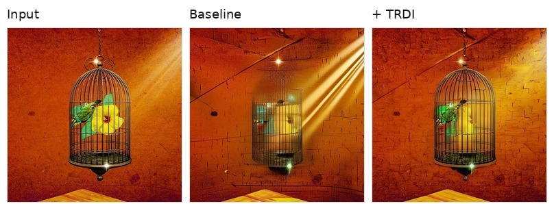
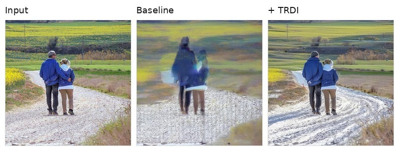
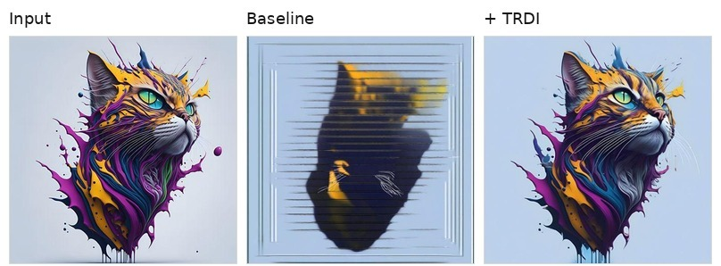
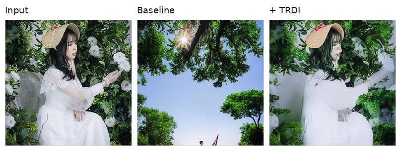
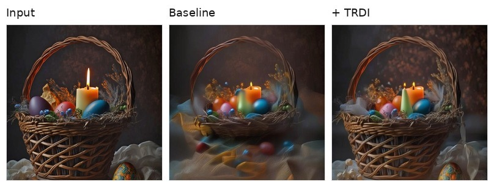
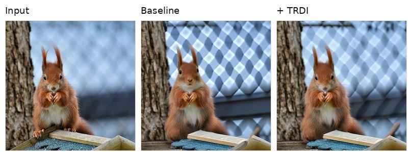
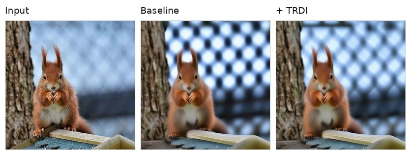
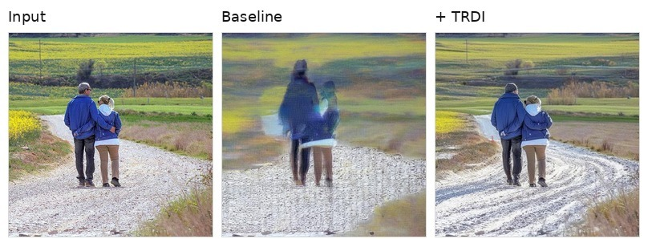

# Codes of Timestep Rescheduling in Diffusion Inversion (TRDI)

This repository is a collection of diffusion inversion methods with our proposed **Timestep Rescheduling in Diffusion Inversion (TRDI)** algorithm. We implemented all mentioned methods in the repository using [diffusers](https://github.com/huggingface/diffusers), [diffusion-inversion](https://github.com/wmchen/diffusion-inversion) and extended them with our TRDI enhancement.

## 🚀 Key Features

- **TRDI Algorithm**: Our proposed timestep rescheduling method that enhances existing diffusion inversion techniques
- **Comprehensive Benchmarks**: Extensive evaluation on PIEBench and COCO datasets
- **Multiple Applications**: Support for both image editing and image reconstruction tasks
- **Plug-and-Play**: Easy integration with existing inversion methods

## 1. Installation

Create and activate a `conda` environment:

```bash
conda create -n TRDI python=3.10
conda activate TRDI
```

Clone this Repository:

```bash
git clone https://github.com/sunshangquan/TRDI.git
cd TRDI
```

Install PyTorch:

```bash
pip install -r requirements/torch.txt
```

Install other packages:

```bash
pip install -r requirements/build.txt
```

## 2. Getting Started

Please refer to [exp/](./exp/unet_based) for a quick start on using TRDI with different inversion methods. The core implementation of TRDI is at [TRDI.py](TRDI.py)

## 3. Supported Methods with TRDI Enhancement

### 3.1 UNet-based Diffusion Models with TRDI

| Method | TRDI Enhanced | Image Editing (PIEBench) | Image Reconstruction (COCO) | Implementation |
| ------ | ------------- | ----------------------- | -------------------------- | -------------- |
| DDIM Inversion | ✓ | ✅ Improved | ✅ Improved | [code](./inversions/unet_based/ddim) |
| Negative Prompt Inversion (NPI) | ✓ | ✅ Improved | ✅ Improved | [code](./inversions/unet_based/npi) |
| ReNoise | ✓ | ✅ Improved | ✅ Improved | [code](./inversions/unet_based/renoise) |
| Guided Newton Raphson Inversion (GNRI) | ✓ | ✅ Improved | ✅ Improved | [code](./inversions/unet_based/gnri) |

## 4. Qualitative Examples

Please refer to the [paper](https://arxiv.org/abs/2606.15389) for the complete quantitative results. We do not duplicate numerical tables here to avoid version drift between the repository and the paper.

The following examples show the same input edited with a baseline inversion method and with TRDI-enabled timestep rescheduling.


*Prompt: remove the flower*


*Prompt: Change the road to a snow covered one*


*Prompt: Add a blue background to the cat with paint on its head*


*Prompt: Change the woman's dress color to red*


*Prompt: Make the background bright rather than dark*


*Prompt: Make the red squirrel reading a book*


*Prompt: Make the red squirrel reading a book*


*Prompt: Change the road to a snow covered one*

## 5. Usage

### Basic Usage with TRDI

```python
import argparse
from TRDI import TRDI

parser = argparse.ArgumentParser()
parser.add_argument("--guidance_scale", type=float, default=0.0)
parser.add_argument('--spacing', default=1.00, type=float)
parser.add_argument('--trdi_window', type=int, default=1) 
args = parser.parse_args()

trdi = TRDI(args.num_inference_steps, spacing=args.spacing, window=args.trdi_window)
timesteps = trdi.init_timesteps("leading")
timesteps = trdi.rescaling_timesteps(timesteps)
timesteps = trdi.reschedule(timesteps)

...

#### for inversion ####
inv_result = pipe.inverse(
    ...
    timesteps=timesteps
)

#### for sampling ####
recon_image = pipe(
    ...
    timesteps=timesteps
)
```

### TRDI examples

#### Stable Diffusion v1.5
```bash
# DDIM Inversion
CUDA_VISIBLE_DEVICES=0 python exp/unet_based/ddim.py --spacing 1.00 --num_inference_steps 50 --model_type SD15 --trdi_window 0 --guidance_scale 1.2; 
# DDIM Inversion w/ Ours
CUDA_VISIBLE_DEVICES=0 python exp/unet_based/ddim.py --spacing 1.00 --num_inference_steps 50 --model_type SD15 --trdi_window 8 --guidance_scale 1.2; 

# ReNoise Inversion
CUDA_VISIBLE_DEVICES=0 python exp/unet_based/renoise.py --spacing 1.00 --num_inference_steps 50 --model_type SD15 --trdi_window 0 --guidance_scale 1.0; 
# ReNoise Inversion w/ Ours
CUDA_VISIBLE_DEVICES=0 python exp/unet_based/renoise.py --spacing 1.05 --num_inference_steps 50 --model_type SD15 --trdi_window 0 --guidance_scale 1.0; 

# NPI Inversion
CUDA_VISIBLE_DEVICES=0 python exp/unet_based/npi.py --spacing 1.00 --num_inference_steps 50 --model_type SD15 --trdi_window 0 --guidance_scale 1.0; 
# NPI Inversion w/ Ours
CUDA_VISIBLE_DEVICES=0 python exp/unet_based/npi.py --spacing 1.05 --num_inference_steps 50 --model_type SD15 --trdi_window 8 --guidance_scale 1.0; 

# GNRI Inversion
CUDA_VISIBLE_DEVICES=0 python exp/unet_based/gnri.py --spacing 1.00 --num_inference_steps 50 --model_type SD15 --trdi_window 0 --guidance_scale 1.2;
# GNRI Inversion w/ Ours
CUDA_VISIBLE_DEVICES=0 python exp/unet_based/gnri.py --spacing 1.05 --num_inference_steps 50 --model_type SD15 --trdi_window 8 --guidance_scale 1.2; 
```

#### SDXL
```bash
# DDIM Inversion
CUDA_VISIBLE_DEVICES=0 python exp/unet_based/ddim.py --spacing 1.00 --num_inference_steps 50 --model_type SDXL --trdi_window 0 --guidance_scale 1.0; 
# DDIM Inversion w/ Ours
CUDA_VISIBLE_DEVICES=0 python exp/unet_based/ddim.py --spacing 1.05 --num_inference_steps 50 --model_type SDXL --trdi_window 8 --guidance_scale 1.0; 

# ReNoise Inversion
CUDA_VISIBLE_DEVICES=0 python exp/unet_based/renoise.py --spacing 1.00 --num_inference_steps 50 --model_type SDXL --trdi_window 0 --guidance_scale 1.0; 
# ReNoise Inversion w/ Ours
CUDA_VISIBLE_DEVICES=0 python exp/unet_based/renoise.py --spacing 1.05 --num_inference_steps 50 --model_type SDXL --trdi_window 8 --guidance_scale 1.0; 

# NPI Inversion
CUDA_VISIBLE_DEVICES=0 python exp/unet_based/npi.py --spacing 1.00 --num_inference_steps 50 --model_type SDXL --trdi_window 0 --guidance_scale 1.0; 
# NPI Inversion w/ Ours
CUDA_VISIBLE_DEVICES=0 python exp/unet_based/npi.py --spacing 1.05 --num_inference_steps 50 --model_type SDXL --trdi_window 10 --guidance_scale 1.0; 

# GNRI Inversion
CUDA_VISIBLE_DEVICES=0 python exp/unet_based/gnri.py --spacing 1.00 --num_inference_steps 10 --model_type SDXL --trdi_window 0 --guidance_scale 1.0;
# GNRI Inversion w/ Ours
CUDA_VISIBLE_DEVICES=0 python exp/unet_based/gnri.py --spacing 1.05 --num_inference_steps 10 --model_type SDXL --trdi_window 10 --guidance_scale 1.0; 
```

#### SDXL Turbo
```bash
# DDIM Inversion
CUDA_VISIBLE_DEVICES=0 python exp/unet_based/ddim.py --spacing 1.00 --num_inference_steps 4 --model_type SDXL_Turbo --trdi_window 0 --guidance_scale 1.0; 
# DDIM Inversion w/ Ours
CUDA_VISIBLE_DEVICES=0 python exp/unet_based/ddim.py --spacing 0.90 --num_inference_steps 4 --model_type SDXL_Turbo --trdi_window 50 --guidance_scale 1.0; 

# ReNoise Inversion
CUDA_VISIBLE_DEVICES=0 python exp/unet_based/renoise.py --spacing 1.00 --num_inference_steps 4 --model_type SDXL_Turbo --trdi_window 0 --guidance_scale 1.0; 
# ReNoise Inversion w/ Ours
CUDA_VISIBLE_DEVICES=0 python exp/unet_based/renoise.py --spacing 0.85 --num_inference_steps 4 --model_type SDXL_Turbo --trdi_window 0 --guidance_scale 1.0; 

# NPI Inversion
CUDA_VISIBLE_DEVICES=0 python exp/unet_based/npi.py --spacing 1.00 --num_inference_steps 4 --model_type SDXL_Turbo --trdi_window 0 --guidance_scale 1.0; 
# NPI Inversion w/ Ours
CUDA_VISIBLE_DEVICES=0 python exp/unet_based/npi.py --spacing 1.05 --num_inference_steps 4 --model_type SDXL_Turbo --trdi_window 25 --guidance_scale 1.0; 

# GNRI Inversion
CUDA_VISIBLE_DEVICES=0 python exp/unet_based/gnri.py --spacing 1.00 --num_inference_steps 4 --model_type SDXL_Turbo --trdi_window 0 --guidance_scale 1.0;
# GNRI Inversion w/ Ours
CUDA_VISIBLE_DEVICES=0 python exp/unet_based/gnri.py --spacing 1.05 --num_inference_steps 4 --model_type SDXL_Turbo --trdi_window 50 --guidance_scale 1.0; 
```

### Reproduction runners

For reproducible batch runs, use:

- `scripts/run_icml_main_case_from_scratch.py` for PIE-Bench editing.
- `scripts/run_icml_recon_case_from_scratch.py` for COCO-style reconstruction.
- `scripts/build_icml_main_table_from_run.py`, `scripts/build_icml_recon_table_from_run.py`, and `scripts/build_icml_ablation_table_from_run.py` to aggregate evaluation CSVs into tables.

See [REPRODUCE.md](REPRODUCE.md) for expected input formats and example commands.

## 6. Evaluation
```bash
# for editing
CUDA_VISIBLE_DEVICES=0 python evaluate_my.py --metrics "structure_distance" "psnr_unedit_part" "lpips_unedit_part" "mse_unedit_part" "ssim_unedit_part" "clip_similarity_source_image" "clip_similarity_target_image" "clip_similarity_target_image_edit_part" \
  --edit_category_list 0 1 2 3 4 5 6 7 8 9 \
  --annotation_images \
  --tgt_methods "[ROOT_PATH]res_paper/pie-bench/[FOLDER_NAME]"  ;

# for reconstruction
CUDA_VISIBLE_DEVICES=0 python evaluate_coco.py \
    --metrics "psnr" "ssim" "lpips" "mse" --tgt_path input --tgt_methods "[ROOT_PATH]/res_paper/coco/FOLDER_NAME" ;

```

## 7. Citation

If you use this codebase or our TRDI algorithm in your research, please cite:

```bibtex
@misc{sun2026timestepreschedulingdiffusioninversion,
      title={Timestep Rescheduling in Diffusion Inversion}, 
      author={Shangquan Sun and Ting Gong and Zhirui Liu and Jiamin Wu and Runkai Zhao and Mianxin Liu and Wenqi Ren and Xiaochun Cao},
      year={2026},
      eprint={2606.15389},
      archivePrefix={arXiv},
      primaryClass={cs.CV},
      url={https://arxiv.org/abs/2606.15389}, 
}
```

## 8. License and Acknowledge

This project is intended for research use only, licensed under the [Apache-2.0 license](https://www.apache.org/licenses/LICENSE-2.0).
Many thanks to the prior works [diffusers](https://github.com/huggingface/diffusers) and [diffusion-inversion](https://github.com/wmchen/diffusion-inversion).
