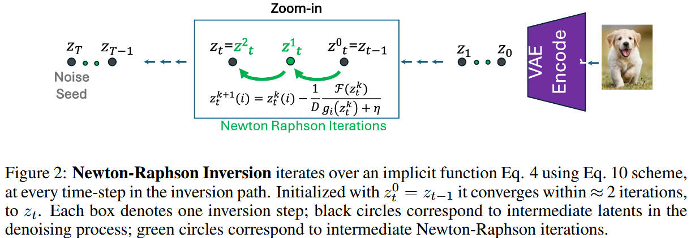

# Guided Newton Raphson Inversion (GNRI)

[ICLR 2025] **Lightning-Fast Image Inversion and Editing for Text-to-Image Diffusion Models**

> Dvir Samuel, Barak Meiri, Haggai Maron, Yoad Tewel, Nir Darshan, Shai Avidan, Gal Chechik, Rami Ben-Ari

> OriginAI, Tel-Aviv University, Bar-Ilan University, Technion, NVIDIA Research

